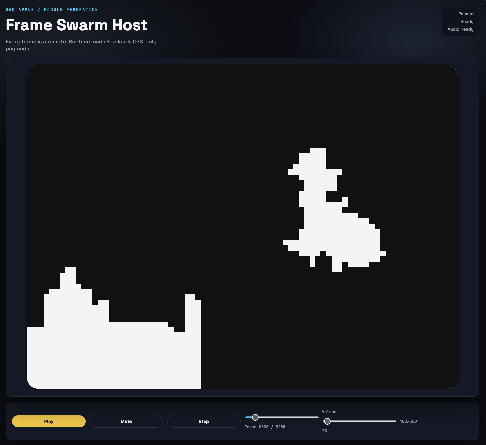

# Bad Apple MF

Monorepo with one host and many module federation remotes (one per frame). Remotes export HTML + CSS payloads and are loaded at runtime.



## Quick start

```sh
pnpm install

# 1) Extract PNG frames from the video (requires yt-dlp + ffmpeg)
yt-dlp -o frames/bad-apple.%(ext)s "https://www.youtube.com/watch?v=FtutLA63Cp8"
ffmpeg -i frames/bad-apple.* -vf fps=24 frames/%05d.png

# 2) Generate per-frame remotes from PNGs (code-only, generated output is gitignored)
pnpm frames:generate --frames-dir=./frames --frames=5258 --width=480 --height=360 --pixel=6 --threshold=140

# 3) Build all remotes + serve them
pnpm frames:build:all:rs
pnpm frames:serve

# 4) Run host
pnpm host:dev
```

Open `http://localhost:3000`.

## Audio

Drop an mp3 at `apps/host/public/bad-apple.mp3` (gitignored). Host will auto-load it via `window.__BAD_APPLE__.audioUrl`.

## Deploy (Zephyr)

Both `apps/host` and `apps/frames-cdn` are wrapped with `withZephyr()` (from `zephyr-rsbuild-plugin`).

### Goal

Publish the remotes so each frame has its own URL:

- `https://<frames-cdn-deployment>/frame-0001/mf-manifest.json`
- ...
- `https://<frames-cdn-deployment>/frame-5258/mf-manifest.json`

Then configure the host to load remotes from that base URL.

### Build + Pack

1. Generate frame remotes from PNGs (local only; inputs are gitignored):

```sh
pnpm frames:generate --frames-dir=./frames --frames=5258 --width=480 --height=360 --pixel=6 --threshold=140
```

2. Build all remotes:

```sh
pnpm frames:build:all:rs
```

3. Pack built `dist/` folders into the CDN app's `public/`:

```sh
pnpm frames:pack:cdn
```

4. Build/deploy the CDN:

```sh
pnpm -C apps/frames-cdn build
```

### Host Config

Set the frames base URL in one of two ways:

- Recommended: set `ZE_PUBLIC_FRAMES_BASE_URL` in Zephyr (host app env vars).
- Or set `window.__BAD_APPLE__.baseUrl` in `apps/host/public/index.html`.

Optional (advanced): if frames are truly hosted at different origins per frame, set `ZE_PUBLIC_FRAME_REMOTE_TEMPLATE` (or `window.__BAD_APPLE__.remoteTemplate`) and use placeholders:

- `{frameId}`: `0001`
- `{frameDir}`: `frame-0001`

Example template:

`https://my-cdn.example.com/{frameDir}/mf-manifest.json`

## PNG frames -> CSS (node)

```sh
pnpm frames:generate \
  --frames-dir=./frames \
  --frames=5258 \
  --width=480 \
  --height=360 \
  --pixel=6 \
  --threshold=140
```

Notes:
- `--pixel` controls downscale (bigger = fewer points, lighter CSS).
- Or specify `--cols` / `--rows` directly.
- Keep host `frameWidth`/`frameHeight` aligned with `--width`/`--height`.

## Config

- Host runtime config: `apps/host/public/index.html` (`window.__BAD_APPLE__`)
- Frame generator: `scripts/generate-frames.mjs`
- Frame remotes (generated): `apps/frames/frame-0001` etc (gitignored)

## Notes

- `scripts/serve-frames.mjs` serves `apps/frames/*/dist` with CORS for the host runtime.
- Frame remotes use `mf-manifest.json` via `@module-federation/rsbuild-plugin`.
- Placeholder CSS uses gradients; PNG mode uses box-shadow pixels.
